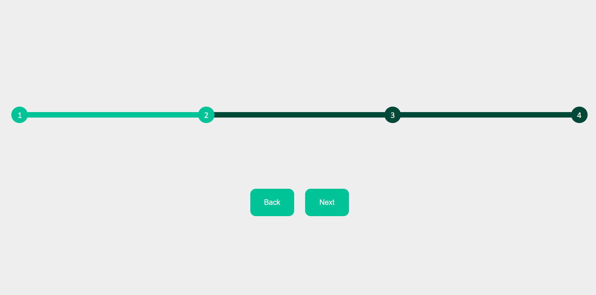

# Multi-Thumb-Slider


The Slider web component.

## Usage
- install node modules
- build component `npm run build`.
- link script file to your project. `'./dist/main.js'`.
- well done. now you can use this component in your project.

# Html tag and attribute properties
```html
<sahbaee-slider point="5" start="2" forward_btn="next" backward_btn="back"></sahbaee-slider>

<button sahbaee_slider_backward="back">back</button>
<button sahbaee_slider_forward="next">next</button>
```
